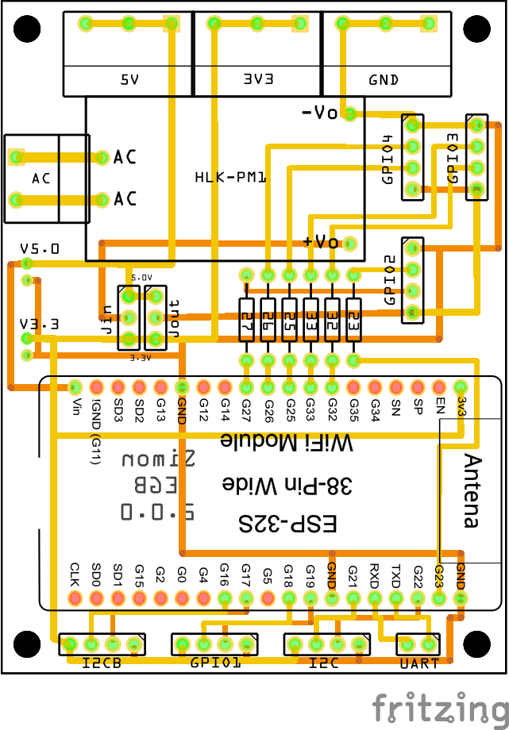

# Esp Generic Board
The goal of this project is to build a PCB that exposes some of the generic output of a ESP32 DevKit on a PCB of 6 * 8cm

## Inputs
### Power Supply
You can power the board from :
- A AC-DC converter with format HLK-PMxx, like this one : https://amzn.to/3MS7B2v, please check the format before buying because it's not standard.
  - You have to put the jumper Jin on 3.3V or 5V depending of the power supply
  - I suggest to power with 5V to ensure max output

The 140-220V AC input is provided with connector like these : https://amzn.to/3pWHxKi or https://amzn.to/43n3ArU

### DC Input
DC power can be connected to on of the three connectors on bottom of the board. 

The exposed inputs are 5V, 3.3V with the following connectors : https://amzn.to/42YOgCf

Be aware : the connectors is 2mm and not 2.54mm because it's the most commonly used in Lipo :)

## Outputs
## GPIO
### GPIO1
The GPIO1 expose the GPIO 18 and 19, with ground and 3.3V on bottom of the board, with connectors like this : https://amzn.to/3OtbCLU, ground on right, 3.3V on left.

### GPIO2, 3, 4
The GPIO2, 3 and 3 expose the GPIO 23,25,26,27,32 and 33, with ground and V on the right of the board, with connectors like this : https://amzn.to/3OtbCLU
To select the output voltage for the V pin, you can use the jumper Jout

All these GPIO can have resistor, or simple wire if no resistor is required, on the center of the board.

### DC Output
On top of the board, there is three connectors for GROUND, 3.3V and 5V that can be used with connector like these : https://amzn.to/3pWHxKi or https://amzn.to/43n3ArU

These connectors can also be used as DC input.

Note : the track for all the GROUND and DC Power is 32mil width, it can handle up to 2A depending the the DC Input max current (https://amzn.to/3MS7B2v is only 0.6A)

## UART
The uart is exposed on bottom right of the board with connecter like this : https://amzn.to/3IvOrMX

## I2C
The I2C ports are exposed on bottom of the board, with connectors like this : https://amzn.to/3OtbCLU, ground on right, 3.3V on left.
